# handwriting-generation

Train a network to generate handwriting both unconditionally and conditionally based on text input. This code is based on [Generating Sequences With Recurrent Neural Networks](https://arxiv.org/pdf/1308.0850.pdf).

## How do I run it?

Run the jupyter notebook in Docker:

* `source run_docker.sh`
* Follow the link in the terminal to run `notebooks/results.ipynb` to generate some samples!

Or run it locally:

* `source run_local.sh`

## Results

The results can be run in a jupyter notebook using `./run_docker.sh` or `./run_local.sh`

#### Unconditionally Generated Samples

|   |
|---|
| 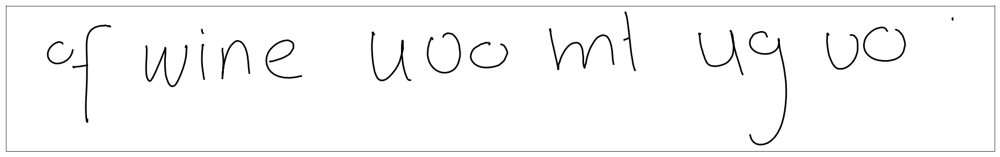  |
| 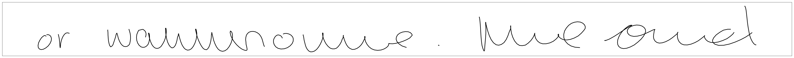  |
| 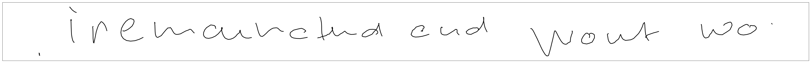  |

#### Conditionally Generated Samples

`Baruch Tabanpour was here `

|   |
|---|
| 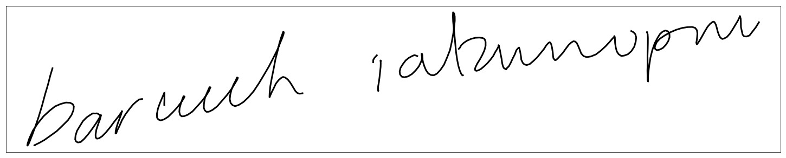  |
| 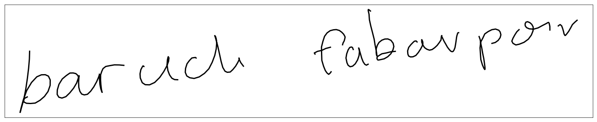  |

`france will win the world cup`

|   |
|---|
| 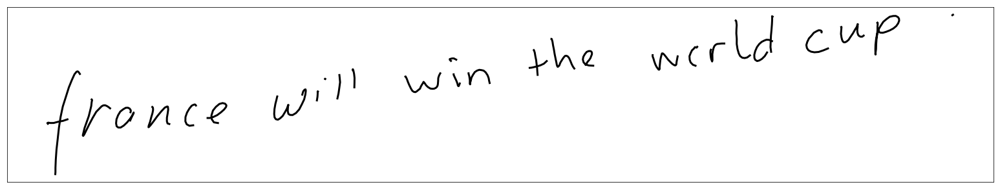  |
| 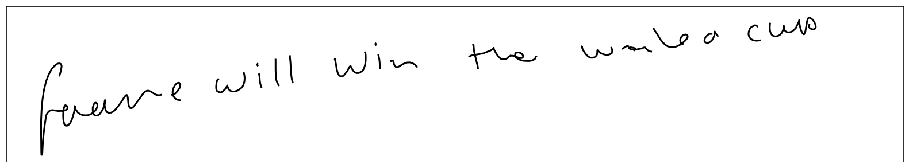  |

`welcome to my house`

|   |
|---|
| 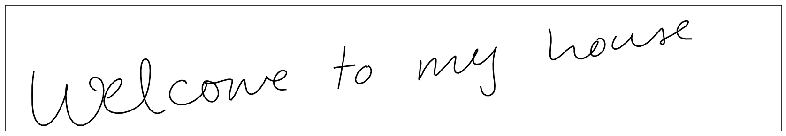  |
| 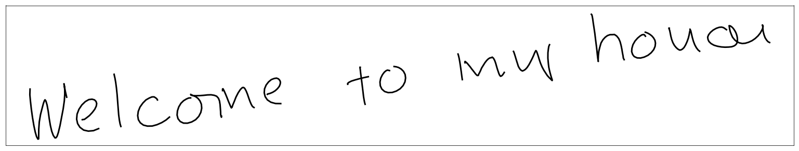  |

`welcome to canada`

|   |
|---|
| 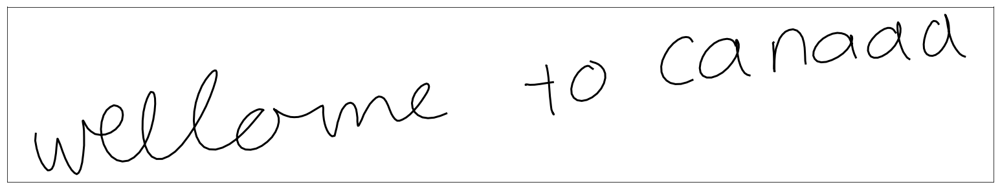  |
| 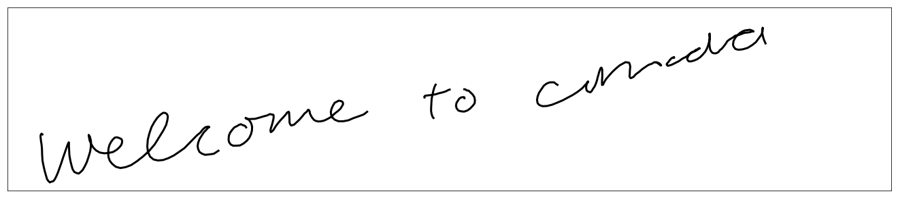  |

## Training

Set these env vars to point to your data and model directories:

* `HANDWRITING_GENERATION_DATA_DIR`
* `HANDWRITING_GENERATION_MODEL_DIR`

Then you can train one of the models:

* Unconditional stroke generation:
    - `python unconditional_stroke_model.py ../models/unconditional-stroke-model-1/`
* Conditional stroke generation:
    - `python conditional_stroke_model.py ../models/conditional-stroke-model-1/`
