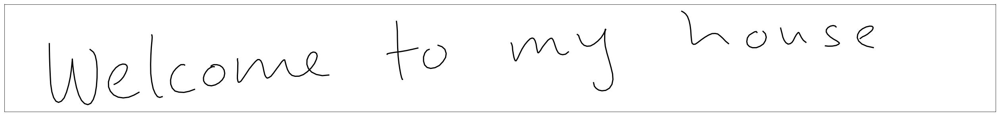
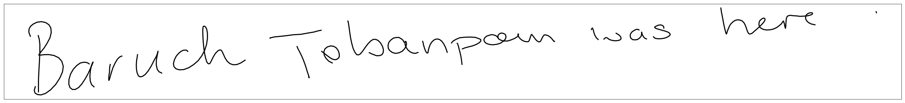
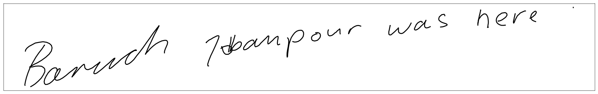
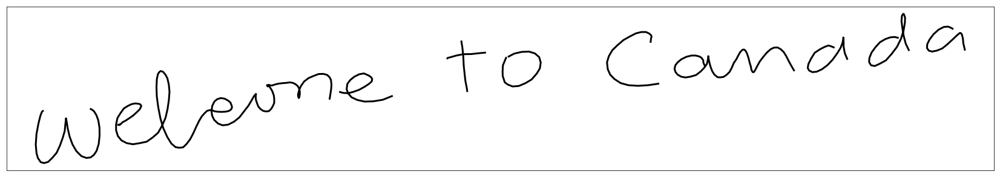

# handwriting-generation

Based on [Generating Sequences With Recurrent Neural Networks](https://arxiv.org/pdf/1308.0850.pdf).

## How to run?

To run the jupyter notebook in Docker:

* `source run_docker.sh`
* Follow the link so that you can run `notebooks/results.ipynb` to generate some samples!

To run locally:

* `source run_local.sh`

## Results

The results can be run in a jupyter notebook using `./run_docker.sh` or `./run_local.sh`

#### Unconditionally Generated Samples

|   |
|---|
|   |
|   |
|   |

#### Conditionally Generated Samples

`welcome to my house`

|   |
|---|
|   |
|   |

`baruch tabanpour`

|   |
|---|
| [  |
| [  |

`welcome to canada`

|   |
|---|
|   |
|   |

`the world cup`

|   |
|---|
|   |
|   |

## Training

Set these env vars to your data and model directories:

* `HANDWRITING_GENERATION_DATA_DIR`
* `HANDWRITING_GENERATION_MODEL_DIR`

Then you can train one of the models:

* Unconditional stroke generation:
    - `python unconditional_stroke_model.py ../models/unconditional-stroke-model-1/`
* Conditional stroke generation:
    - `python conditional_stroke_model.py ../models/conditional-stroke-model-1/`
